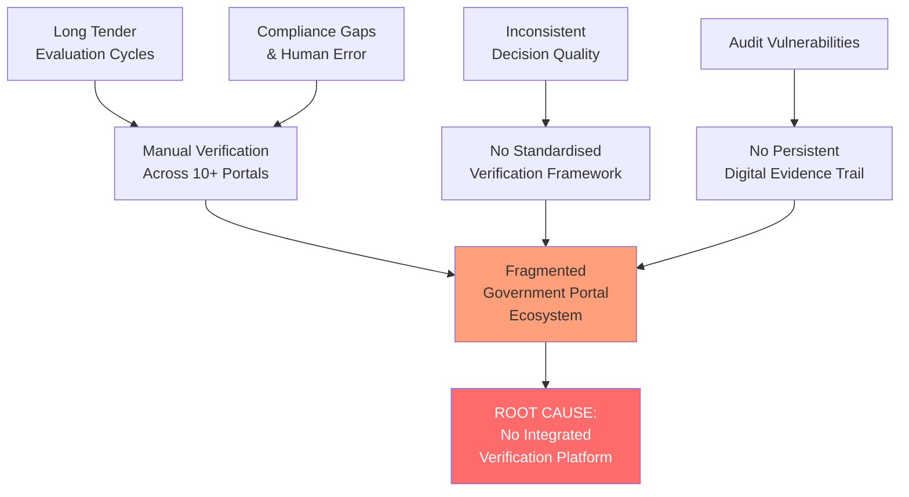
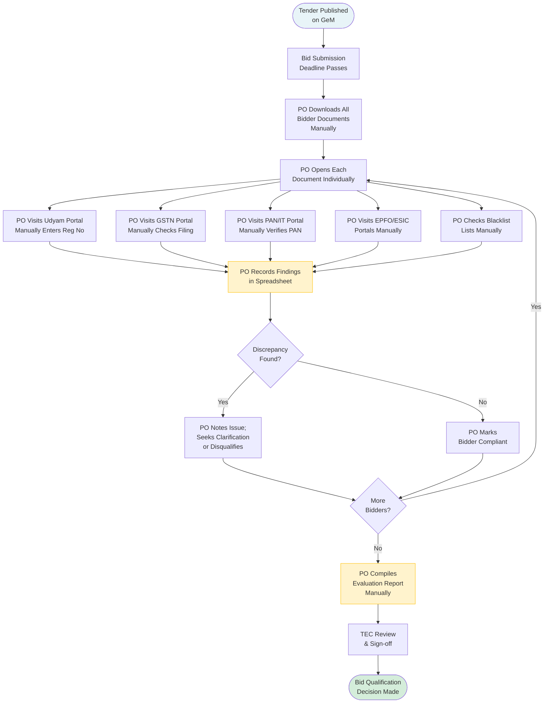
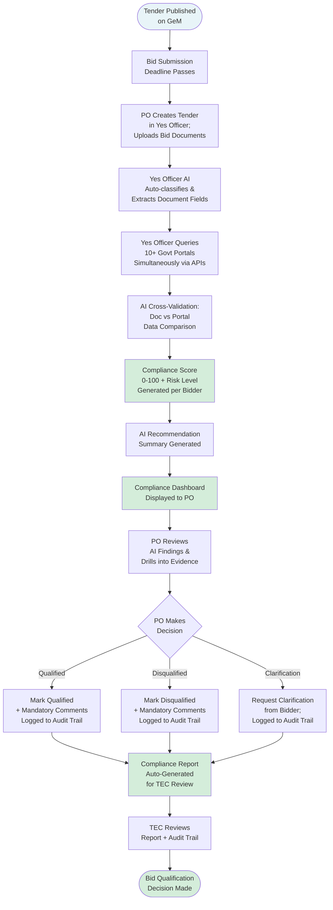

# Business Requirements Document (BRD)

## Yes Officer — AI-Powered Integrated Bid Compliance Verification Platform for GeM Procurement

| Field | Detail |
|---|---|
| **Problem Statement ID** | 26100 |
| **Organization** | Ministry of Petroleum & Natural Gas |
| **Department** | Chennai Petroleum Corporation Limited (CPCL) |
| **Product Name** | **Yes Officer** |
| **Document Type** | Business Requirements Document (BRD) |
| **Version** | 1.0 |
| **Date** | September 6, 2026 |
| **Status** | Draft — Awaiting Stakeholder Sign-off |
| **Companion Document** | [Product Requirements Document (PRD)](./PRD.md) |

---

## Table of Contents

1. [Executive Summary](#1-executive-summary)
2. [Business Problem & Opportunity](#2-business-problem--opportunity)
3. [Stakeholder Analysis](#3-stakeholder-analysis)
4. [Business Objectives & Success Criteria](#4-business-objectives--success-criteria)
5. [Current State vs Future State](#5-current-state-vs-future-state)
6. [Business Requirements](#6-business-requirements)
7. [Regulatory & Compliance Context](#7-regulatory--compliance-context)
8. [Cost-Benefit Analysis & Business Case](#8-cost-benefit-analysis--business-case)
9. [Business Risks & Assumptions](#9-business-risks--assumptions)
10. [Change Management & Adoption Plan](#10-change-management--adoption-plan)
11. [Dependencies & Constraints](#11-dependencies--constraints)
12. [Appendices](#12-appendices)

---

## 1. Executive Summary

### 1.1 Business Context

The Government of India's Government e-Marketplace (GeM) platform processes thousands of procurement tenders annually across Central Public Sector Enterprises (CPSEs), ministries, and departments. For every tender, Procurement Officers (POs) are legally mandated to verify the statutory eligibility and compliance of each bidder — spanning Udyam/MSME registration, GST filing status, PAN and Income Tax compliance, EPFO/ESIC contributions, Make in India requirements, blacklisting status, and more.

At Chennai Petroleum Corporation Limited (CPCL), this verification burden is carried entirely through manual processes — officers visiting 10+ government portals per bidder, cross-referencing documents, and compiling findings in spreadsheets. With growing procurement volumes and increasingly complex compliance matrices, this approach is no longer sustainable.

### 1.2 The Business Case in Brief

**Yes Officer** is an AI-powered decision-support platform that integrates with government portals and databases to automate compliance verification, generate a Compliance Score with risk classification, and deliver AI-powered recommendations — enabling Procurement Officers to make faster, more accurate, and fully auditable bid qualification decisions.

> [!IMPORTANT]
> **Yes Officer is a decision-support tool.** It does not make, replace, or override procurement decisions. All qualification and disqualification decisions remain exclusively with the authorised Procurement Officer. The AI functions as a verification and analysis assistant.

### 1.3 Strategic Alignment

| Strategic Priority | How Yes Officer Aligns |
|---|---|
| Digital India — Government Digitisation | Automates a manual government process end-to-end |
| Make in India | Systematic enforcement of PPO local content requirements |
| Transparent & Accountable Procurement | Complete, immutable audit trail for every decision |
| Atmanirbhar Bharat CPSE Efficiency | Faster tender evaluation enables faster project execution |
| Startup India / MSME Empowerment | Consistent, rule-based MSME/startup privilege verification |

---

## 2. Business Problem & Opportunity

### 2.1 Problem Statement

Government procurement officers at CPCL and across CPSEs are required to manually verify bidder eligibility and statutory compliance across multiple government portals for every tender. This process is:

| Dimension | Current Pain |
|---|---|
| **Effort** | 2–4 officer-hours per bidder; 20–100+ hours per tender with multiple bidders |
| **Accuracy** | Dependent on individual officer diligence; no systemic cross-validation |
| **Consistency** | No standardised framework — different officers apply different rigour |
| **Speed** | Tender evaluation cycles stretched from days to weeks |
| **Auditability** | No persistent, reproducible digital trail of verification activities |
| **Fraud Risk** | Forged or mismatched documents not always detected through manual inspection |
| **Compliance Risk** | Officers may miss complex multi-portal compliance checks (e.g., GST return filing timelines) |

### 2.2 Root Cause Analysis



### 2.3 Opportunity

The lack of an integrated compliance verification platform represents a significant operational improvement opportunity:

- **Operational Efficiency:** Automating 80%+ of routine verification tasks frees officer bandwidth for higher-value judgment calls.
- **Compliance Quality:** Systematic portal cross-validation catches discrepancies that manual checks miss, reducing fraud risk.
- **Scalability:** As CPCL's procurement volume grows, manual verification creates a linear bottleneck. An automated platform scales non-linearly.
- **Replicability:** A solution designed for CPCL can be standardised and deployed across other CPSEs and government organisations, multiplying impact.
- **Policy Enforcement:** Automated, consistent enforcement of PPO Make-in-India mandates, MSME purchase preferences, and startup relaxations.

### 2.4 Opportunity Sizing

| Metric | Estimated Value |
|---|---|
| CPCL annual tenders (approximate) | 500–800 tenders/year |
| Average bidders per tender | 8–15 bidders |
| Officer-hours currently spent on compliance verification | ~15,000–30,000 hours/year at CPCL alone |
| Potential hours saved (60–80% automation) | 9,000–24,000 hours/year |
| Equivalent officer FTE freed | 5–12 FTE-equivalents per year |
| Scalability if deployed across 50+ CPSEs | 50x impact multiplication |

---

## 3. Stakeholder Analysis

### 3.1 Stakeholder Register

| ID | Stakeholder | Organisation | Role in Project | Influence | Interest |
|---|---|---|---|---|---|
| S1 | Procurement Officer (PO) | CPCL | Primary User | High | High |
| S2 | Tender Evaluation Committee (TEC) | CPCL | Reviewer / Co-signer | High | High |
| S3 | Vigilance / Compliance Officer | CPCL / CVC | Auditor | Medium | High |
| S4 | IT Department Head | CPCL | Technical Approver | High | Medium |
| S5 | CFO / Finance Head | CPCL | Budget Approver | High | Medium |
| S6 | CMD / Director (Finance) | CPCL | Executive Sponsor | Very High | Low |
| S7 | MoPNG (Ministry) | Central Government | Policy Authority | Very High | Low |
| S8 | GeM Secretariat | MoCI | Platform Owner | High | Low |
| S9 | GSTN / Government APIs | Various Ministries | Integration Partner | Medium | Low |
| S10 | SIH Evaluation Panel | Smart India Hackathon | Evaluator | Very High | High |
| S11 | Development Team | Yes Officer Team | Builder | Medium | High |
| S12 | Bidder Community | External | Indirect Beneficiary | Low | Medium |

### 3.2 Stakeholder Influence-Interest Grid

```
HIGH INTEREST
     │
     │   S3 (Vigilance)    S1 (PO)
     │   S10 (SIH Panel)   S2 (TEC)
     │   S11 (Dev Team)
     │
     │   S12 (Bidders)     S5 (CFO)
     │                     S4 (IT Head)
     │
     │                     S6 (CMD)
     │                     S7 (MoPNG)
     │                     S8 (GeM)
LOW INTEREST
     └──────────────────────────────────
     LOW INFLUENCE          HIGH INFLUENCE
```

| Grid Quadrant | Stakeholders | Strategy |
|---|---|---|
| **High Influence + High Interest** (Manage Closely) | S1 (PO), S2 (TEC), S5 (CFO), S4 (IT Head) | Deep engagement; involve in design reviews; regular status updates |
| **High Influence + Low Interest** (Keep Satisfied) | S6 (CMD), S7 (MoPNG), S8 (GeM) | Executive briefings; policy alignment demonstrations; minimal day-to-day involvement |
| **Low Influence + High Interest** (Keep Informed) | S3 (Vigilance), S10 (SIH), S11 (Dev Team), S12 (Bidders) | Regular updates; demo previews; feedback channels |
| **Low Influence + Low Interest** (Monitor) | S9 (APIs/Portals) | Dependency tracking only |

### 3.3 RACI Matrix

| Activity | S1 PO | S2 TEC | S3 Vigilance | S4 IT | S5 CFO | S6 CMD | S11 Dev Team |
|---|---|---|---|---|---|---|---|
| Business Requirements Sign-off | C | C | I | C | C | **A** | R |
| Platform Design & Build | I | I | I | C | I | I | **A/R** |
| Integration Approvals | I | I | I | **A** | C | I | R |
| User Acceptance Testing | **A/R** | R | C | C | I | I | R |
| Go-Live Approval | C | C | I | C | C | **A** | R |
| Audit Trail Review | C | C | **A/R** | I | I | I | C |
| Bid Qualification Decisions | **A/R** | C | I | I | I | I | I |

*R=Responsible, A=Accountable, C=Consulted, I=Informed*

---

## 4. Business Objectives & Success Criteria

### 4.1 SMART Business Objectives

#### BO-1: Reduce Compliance Verification Effort
> **Specific:** Automate ≥80% of statutory compliance checks for GeM bidders  
> **Measurable:** Officer time per bidder verification reduced from 2–4 hours to ≤30 minutes  
> **Achievable:** Via multi-portal API integration and AI document extraction  
> **Relevant:** Directly addresses the primary operational bottleneck  
> **Time-bound:** Achieved within 6 months of production deployment

#### BO-2: Improve Compliance Detection Accuracy
> **Specific:** Detect ≥95% of non-compliant submissions that would otherwise require manual cross-checking  
> **Measurable:** <2% false-positive flag rate; <5% missed discrepancy rate  
> **Achievable:** Through AI cross-validation of extracted data against portal-verified values  
> **Relevant:** Reduces fraud risk and incorrect bid qualifications  
> **Time-bound:** Benchmarked at 3-month and 6-month post-deployment reviews

#### BO-3: Ensure 100% Audit Readiness
> **Specific:** Every verification activity, portal query, and officer decision logged with timestamp and evidence  
> **Measurable:** Audit trail reconstruction time from 2–3 days to real-time (minutes)  
> **Achievable:** Via immutable append-only event log integrated into every system action  
> **Relevant:** Meets CVC, CAG, and RTI compliance requirements  
> **Time-bound:** From day one of production deployment

#### BO-4: Standardise Compliance Verification Across CPCL
> **Specific:** All Procurement Officers apply identical compliance check framework for every tender  
> **Measurable:** Zero cases of "officer-to-officer" variance in compliance check scope  
> **Achievable:** Via configurable compliance rules engine applied uniformly  
> **Relevant:** Eliminates subjective variation and associated legal/audit risk  
> **Time-bound:** Within 3 months of full rollout at CPCL

#### BO-5: Demonstrate Replicability for Multi-CPSE Deployment
> **Specific:** Platform architecture supports deployment to 3+ additional CPSEs without re-architecture  
> **Measurable:** At least 1 additional CPSE piloted within 12 months of CPCL launch  
> **Achievable:** Through multi-tenant design and configurable compliance rules  
> **Relevant:** Multiplies impact and justifies investment  
> **Time-bound:** 12 months post-CPCL production launch

### 4.2 Success Criteria Summary

| Objective | Key Result | Measurement Method | Target Date |
|---|---|---|---|
| BO-1: Reduce Effort | Officer-hours/bidder ≤ 30 min | Time tracking logs | Month 6 |
| BO-2: Accuracy | Discrepancy detection ≥95% | Parallel audit against manual verification | Month 3 & 6 |
| BO-3: Audit Readiness | Audit trail instant retrieval | System test + CAG review readiness | Day 1 of prod |
| BO-4: Standardisation | Compliance framework uniformity = 100% | Tender evaluation review sample | Month 3 |
| BO-5: Replicability | 1 additional CPSE piloted | Signed MoU / deployment record | Month 12 |

---

## 5. Current State vs Future State

### 5.1 Current State ("As-Is") Process Map



**As-Is Pain Points Summary:**

| # | Pain Point | Frequency | Business Impact |
|---|---|---|---|
| P1 | Officer manually visits 10+ portals per bidder | Every bid, every bidder | 2–4 hours wasted per bidder |
| P2 | No cross-validation between documents and portals | Every bid | Forged/expired docs go undetected |
| P3 | GST return timeline checks often skipped | ~40% of bids | Non-compliant GST filers qualify incorrectly |
| P4 | Blacklist check scope varies by officer | ~30% of bids | Debarred entities may re-enter with new registrations |
| P5 | No standardised scoring or risk level | 100% of bids | Inconsistent qualification criteria |
| P6 | Spreadsheet-based findings not auditable | 100% of bids | CAG/CVC audit exposure |
| P7 | Officer bandwidth bottleneck during peak tender periods | Quarterly | Delayed project award, cost escalation |

### 5.2 Future State ("To-Be") Process Map



### 5.3 State Comparison Table

| Dimension | As-Is (Manual) | To-Be (Yes Officer) | Improvement |
|---|---|---|---|
| Time per bidder | 2–4 hours | 15–30 minutes | **80–87% reduction** |
| Portal coverage per bidder | Varies (officer-dependent) | 10+ portals, systematic | **100% coverage** |
| Cross-validation | None | Automated AI cross-check | **New capability** |
| Compliance scoring | None (subjective) | 0–100 score + risk level | **New capability** |
| Fraud detection | Limited (visual inspection) | AI document forensics | **New capability** |
| Audit trail | Spreadsheet / paper | Immutable digital log | **Legally defensible** |
| Report generation | Manual (hours) | Automated (seconds) | **99%+ reduction** |
| Standardisation | Per-officer | Platform-enforced rules | **100% consistent** |

---

## 6. Business Requirements

> [!NOTE]
> These are **business requirements** — they describe *what the business needs*, not *how the system implements it*. Technical implementation details are in the [PRD](./PRD.md).

### 6.1 Document Verification Requirements

| BR ID | Business Requirement | Priority | Business Rationale |
|---|---|---|---|
| BR-1.1 | The system shall enable Procurement Officers to submit bidder documents digitally for automated compliance verification | Must Have | Eliminates manual portal navigation; foundational capability |
| BR-1.2 | The system shall support all document formats routinely submitted by GeM bidders (PDF, scanned images) | Must Have | Bidders submit varied document quality and format |
| BR-1.3 | The system shall automatically identify the type of each document submitted (e.g., GST certificate, PAN card, Udyam certificate) | Must Have | Manual classification is error-prone and time-consuming |
| BR-1.4 | The system shall extract and preserve key compliance data from each document for audit trail purposes | Must Have | Raw evidence must be preserved for legal and audit defensibility |
| BR-1.5 | The system shall flag documents with low confidence extraction for officer review | Must Have | Ensures human review where AI confidence is insufficient |
| BR-1.6 | The system shall maintain version history when bidders resubmit documents | Should Have | Tracks document supersession for audit completeness |

### 6.2 Statutory Compliance Verification Requirements

| BR ID | Business Requirement | Priority | Business Rationale |
|---|---|---|---|
| BR-2.1 | The system shall verify a bidder's Udyam/MSME registration status and category directly from the Udyam portal | Must Have | MSME status determines purchase preference entitlements under MSME Development Act 2006 |
| BR-2.2 | The system shall verify GST registration status (Active / Cancelled / Suspended) against GSTN | Must Have | A cancelled/suspended GST registration is a mandatory disqualification criterion |
| BR-2.3 | The system shall verify that the bidder has filed GST returns (GSTR-3B) for the required preceding period | Must Have | Return filing compliance is a statutory requirement under GST law |
| BR-2.4 | The system shall verify PAN validity and confirm the PAN belongs to the bidding entity | Must Have | PAN is the foundational identity anchor for all tax-related verification |
| BR-2.5 | The system shall verify Income Tax return filing status for the required assessment years | Must Have | ITR filing compliance is a common tender eligibility requirement |
| BR-2.6 | The system shall verify EPFO establishment registration and compliance status | Should Have | Labour law compliance is required for tenders involving service/manpower |
| BR-2.7 | The system shall verify ESIC registration and contribution compliance | Should Have | ESIC compliance required for tenders with applicable workforce thresholds |
| BR-2.8 | The system shall verify DPIIT Startup India recognition status and certificate validity | Should Have | Recognized startups receive statutory relaxations (PQQ, EMD, prior experience) |
| BR-2.9 | The system shall verify NSIC registration and its validity period | Should Have | NSIC-registered MSMEs are entitled to exemptions from EMD and tender fees |
| BR-2.10 | The system shall verify OEM authorization letter against the authorising manufacturer | Should Have | Ensures resellers/channel partners have valid authority to bid |
| BR-2.11 | The system shall verify Make in India / local content percentage declared by the bidder | Must Have | PPO 2017 mandates minimum local content for eligible products; non-compliance = disqualification |
| BR-2.12 | The system shall check whether the bidder or any associated entity is blacklisted or debarred from government procurement | Must Have | Blacklisted entities must be rejected; currently scattered across multiple lists |
| BR-2.13 | The system shall verify MCA21 company registration and active status for corporate bidders | Could Have | Confirms legal existence and authorised signatories |
| BR-2.14 | The system shall verify BIS certification for product categories where BIS certification is mandatory | Could Have | Mandatory for certain product categories under BIS regulations |

### 6.3 AI Analysis Requirements

| BR ID | Business Requirement | Priority | Business Rationale |
|---|---|---|---|
| BR-3.1 | The system shall cross-validate information across all submitted documents and portal data to identify inconsistencies | Must Have | Forged documents often show cross-field inconsistencies that manual checks miss |
| BR-3.2 | The system shall identify documents that are expired, near-expiry, or have been tampered with | Must Have | Expired certificates are a common compliance failure; tampering is a fraud vector |
| BR-3.3 | The system shall identify missing mandatory documents based on the tender type and applicable requirements | Must Have | Ensures completeness of submissions before qualification |
| BR-3.4 | The system shall generate a numerical Compliance Score (0–100) and Risk Level (Low / Medium / High / Critical) for each bidder | Must Have | Enables objective, comparable assessment across all bidders in a tender |
| BR-3.5 | The system shall generate a plain-language AI recommendation summarising each bidder's compliance status and key risk factors | Must Have | Reduces officer cognitive load; provides a decision-support narrative |
| BR-3.6 | The system shall allow Procurement Officers to configure tender-specific eligibility rules (e.g., minimum turnover, years of experience) | Should Have | Different tenders carry different eligibility thresholds |

### 6.4 Decision Support & Dashboard Requirements

| BR ID | Business Requirement | Priority | Business Rationale |
|---|---|---|---|
| BR-4.1 | The system shall present all bidders in a tender on a single, ranked compliance dashboard | Must Have | Enables holistic, comparative review of all bidders simultaneously |
| BR-4.2 | The system shall provide officers with drill-down access to the evidence underlying every compliance check result | Must Have | Officers must be able to verify AI findings before making decisions |
| BR-4.3 | The system shall require Procurement Officers to record mandatory comments for every bid qualification decision | Must Have | Ensures documented justification for every qualification/disqualification |
| BR-4.4 | The system shall generate a compliance report exportable in a format suitable for TEC review | Must Have | TEC co-signature requirement necessitates a shareable, printable report |
| BR-4.5 | The system shall clearly distinguish between AI-generated findings (advisory) and officer decisions (authoritative) | Must Have | Legal clarity that AI is decision-support, not decision-maker |
| BR-4.6 | The system shall notify Procurement Officers when automated verification results are available | Should Have | Timely notification enables efficient workflow management |

### 6.5 Audit Trail & Governance Requirements

| BR ID | Business Requirement | Priority | Business Rationale |
|---|---|---|---|
| BR-5.1 | The system shall create a tamper-proof, immutable record of every compliance check, data source, timestamp, and result | Must Have | CAG, CVC, and RTI requirements mandate complete, unalterable audit trails |
| BR-5.2 | The system shall log every officer action (login, view, decision, comment, export) with timestamp and IP address | Must Have | Officer accountability and fraud prevention |
| BR-5.3 | The system shall retain all verification and audit data for a minimum of 7 years | Must Have | Government record retention policy; aligns with limitation periods for legal challenges |
| BR-5.4 | The system shall allow authorised Vigilance Officers to query the audit trail independently without requiring PO involvement | Must Have | Independence of audit function is a CVC governance requirement |
| BR-5.5 | The system shall support export of audit trails in machine-readable formats for external audit tools | Should Have | CAG and CVC use their own audit software |

### 6.6 Security & Access Control Requirements

| BR ID | Business Requirement | Priority | Business Rationale |
|---|---|---|---|
| BR-6.1 | The system shall restrict access to bid compliance data to authorised personnel only, based on their role | Must Have | Procurement information is commercially sensitive; unauthorised access is a corruption risk |
| BR-6.2 | The system shall require multi-factor authentication for all user logins | Must Have | MeitY security guidelines and government data protection requirements |
| BR-6.3 | The system shall ensure that no bidder compliance data is shared with competing bidders | Must Have | Commercial sensitivity; prevention of bid manipulation |
| BR-6.4 | The system shall ensure all data is stored within Indian jurisdiction | Must Have | Government data sovereignty requirement |
| BR-6.5 | The system shall comply with the Digital Personal Data Protection Act, 2023 for all PII handled | Must Have | Legal obligation; applies to all bidder PII (PAN, Aadhaar-linked data, etc.) |

### 6.7 Operational Requirements

| BR ID | Business Requirement | Priority | Business Rationale |
|---|---|---|---|
| BR-7.1 | The system shall be available during all government working hours with ≥99.5% uptime | Must Have | Tender evaluation timelines are strict; downtime causes procedural non-compliance |
| BR-7.2 | The system shall support simultaneous verification of multiple tenders | Should Have | CPCL runs multiple tenders concurrently |
| BR-7.3 | The system shall be operable by Procurement Officers without specialised technical training beyond a 1-day orientation | Must Have | Officers are domain experts, not technology specialists |
| BR-7.4 | The system shall provide sufficient explanation of every AI finding for an officer to understand and act on it | Must Have | Officers must understand findings to make defensible decisions |

---

## 7. Regulatory & Compliance Context

### 7.1 Applicable Laws, Rules & Policies

| # | Regulation / Policy | Issuing Authority | Relevance to Yes Officer |
|---|---|---|---|
| 1 | **General Financial Rules (GFR), 2017** | Ministry of Finance | Rule 149: mandates e-procurement; Rule 200+: procurement procedures and transparency |
| 2 | **Public Procurement Policy for MSEs, 2012** | MoMSME | Mandates 25% procurement from MSEs; purchase preference rules |
| 3 | **Public Procurement Order (PPO), 2017 (amended 2019)** | DPIIT | Class I / II / III Local Supplier thresholds; Make in India mandatory local content %; L1 bidder preference rules |
| 4 | **GeM General Terms & Conditions** | GeM Secretariat / MoCI | Bidder eligibility criteria; debarment provisions; document requirements |
| 5 | **MSME Development Act, 2006** | Parliament | Defines Micro, Small, Medium enterprises; basis for MSME purchase preference |
| 6 | **Startup India Action Plan, 2016 & DPIIT Recognition Scheme** | DPIIT | Defines eligible startups; exemptions from prior experience/turnover in tenders |
| 7 | **EPFO – Employees' Provident Funds Act, 1952** | Ministry of Labour | Mandatory EPFO registration for establishments with ≥20 employees |
| 8 | **ESIC – Employees' State Insurance Act, 1948** | Ministry of Labour | Mandatory ESIC registration for applicable establishments |
| 9 | **Central Vigilance Commission (CVC) Guidelines** | CVC | Integrity pact requirements; blacklisting procedures; audit requirements |
| 10 | **IT Act, 2000 & Amendments** | Parliament | Electronic records, digital signatures, cyber offences |
| 11 | **Digital Personal Data Protection (DPDP) Act, 2023** | Parliament | Consent, purpose limitation, data minimisation, and rights of data principals (bidders) |
| 12 | **MeitY Cloud Security Guidelines** | MeitY | Governs cloud deployment of government systems; data localisation requirements |
| 13 | **Income Tax Act, 1961 (Section 206AB/206CCA)** | Parliament | Compliance requirement for entities filing ITR; relevant to TDS compliance checks |
| 14 | **GST Act, 2017 (CGST/SGST)** | Parliament | GST registration mandatory for supply above threshold; return filing obligations |
| 15 | **Companies Act, 2013 (MCA21)** | Ministry of Corporate Affairs | Corporate identity verification; director disqualification checks |

### 7.2 Compliance Matrix for Yes Officer Platform Itself

| Obligation | How Yes Officer Complies |
|---|---|
| DPDP Act 2023 — Purpose Limitation | Bidder PII collected only for compliance verification; no secondary use |
| DPDP Act 2023 — Data Minimisation | Only fields necessary for compliance checks are extracted and stored |
| DPDP Act 2023 — Storage Limitation | Data retained per GFR policy (7 years); automated deletion thereafter |
| GFR 2017 — Audit Trail | All verification activities logged immutably with timestamps and sources |
| MeitY Security Guidelines | AES-256 encryption at rest; TLS 1.3 in transit; hosted on NIC/MeitY-approved cloud |
| CVC Guidelines — Independence of Audit | Vigilance Officers have independent, read-only access to audit trail |
| IT Act 2000 — Electronic Records | Digital audit trail is a legally valid electronic record under Section 65B |

---

## 8. Cost-Benefit Analysis & Business Case

### 8.1 Cost Estimates

#### Development & Deployment Costs (Indicative)

| Cost Category | Phase 1 (MVP) | Phase 2 | Phase 3 | Total |
|---|---|---|---|---|
| Software Development | ₹15–20 L | ₹8–12 L | ₹5–8 L | ₹28–40 L |
| AI/ML Model Development & Training | ₹5–8 L | ₹3–5 L | ₹2–3 L | ₹10–16 L |
| Government API / Integration Licences | ₹2–4 L/year | — | — | ₹2–4 L/year |
| Cloud Infrastructure (MeitY/NIC Cloud) | ₹3–5 L/year | — | — | ₹3–5 L/year |
| Security Audits (VAPT, Penetration Testing) | ₹1–2 L | ₹1–2 L/year | — | ₹1–2 L |
| Training & Change Management | ₹1–2 L | ₹0.5–1 L | ₹0.5 L | ₹2–3.5 L |
| **Total Year 1** | | | | **₹44–65 L** |
| **Annual Operating Cost (Year 2+)** | | | | **₹8–12 L/year** |

> [!NOTE]
> Cost estimates are indicative for SIH evaluation purposes. Actual costs will be determined through CPCL procurement process. Government cloud and open-source tooling significantly reduce infrastructure costs.

### 8.2 Benefit Quantification

#### 8.2.1 Officer Time Savings (Conservative Estimate)

| Parameter | Value |
|---|---|
| Average officer time per bidder (manual) | 3 hours |
| Estimated annual bidders verified at CPCL | 6,000–10,000 |
| Officer-hours spent on verification/year | 18,000–30,000 hours |
| Automation rate | 75% (conservative) |
| Hours saved per year | **13,500–22,500 hours** |
| Average officer cost (all-in, Grade B/C) | ₹800/hour (indicative) |
| **Annual monetary value of time saved** | **₹1.08 Cr – ₹1.80 Cr/year** |

#### 8.2.2 Error & Fraud Prevention Value

| Scenario | Estimated Value |
|---|---|
| Avg. contract value per CPCL tender | ₹50 L – ₹5 Cr |
| Estimated % of tenders with undetected compliance issues (current) | 5–10% |
| Potential contract risk exposure (annual) | ₹2–10 Cr |
| Risk mitigation via automated detection (80% catch rate) | ₹1.6–8 Cr/year |

#### 8.2.3 Audit & Legal Cost Avoidance

| Scenario | Annual Savings |
|---|---|
| Audit preparation effort reduction | ₹5–10 L/year |
| Reduced legal exposure from undocumented decisions | ₹10–50 L/year (risk-adjusted) |

### 8.3 Return on Investment (ROI) Projection

| Year | Investment | Benefits (Conservative) | Net Benefit | Cumulative |
|---|---|---|---|---|
| Year 1 | ₹44–65 L | ₹1.08 Cr | +₹43–64 L | +₹43–64 L |
| Year 2 | ₹8–12 L | ₹1.5 Cr (incl. error prevention) | +₹1.38–1.42 Cr | +₹1.8–2.1 Cr |
| Year 3 | ₹8–12 L | ₹2 Cr (multi-CPSE scale) | +₹1.88–1.92 Cr | +₹3.7–4.0 Cr |

```
ROI (3-Year) = (Total Benefits – Total Costs) / Total Costs × 100
             = (₹4.58 Cr – ₹60–89 L) / ₹60–89 L × 100
             ≈ 420–660% over 3 years
```

**Payback Period:** ~8–10 months post-deployment

### 8.4 Non-Quantifiable Benefits

| Benefit | Description |
|---|---|
| **Organisational Reputation** | Transparent, auditable procurement builds trust with vendors and regulators |
| **Policy Compliance** | Consistent Make in India and MSME preference enforcement supports national policy |
| **Officer Morale** | Eliminating repetitive manual work improves job satisfaction |
| **Scalability Across CPSEs** | Once proven at CPCL, multiplies across India's 250+ CPSEs |
| **Bid Integrity** | Reduced procurement fraud protects public expenditure |

---

## 9. Business Risks & Assumptions

### 9.1 Business Assumptions

| # | Assumption | Confidence | Impact if Wrong |
|---|---|---|---|
| A1 | CPCL management will provide necessary support for procurement of API access licences (GSTN, PAN) | High | Cost and timeline increase; fallback to scraping required |
| A2 | Government portal APIs will remain stable and available during the project lifecycle | Medium | Integration rework required; fallback mechanisms needed |
| A3 | Procurement Officers will engage in UAT and provide feedback during testing phase | High | Poor adoption post-launch |
| A4 | The legal interpretation of AI decision-support (vs. AI decision-making) will remain as intended | High | Platform design already accounts for human-in-the-loop |
| A5 | DPDP Act implementation guidelines will not impose additional restrictions on processing bidder PII for compliance purposes | Medium | Minor feature changes; legal review required |
| A6 | CPCL's annual tender volume (500–800 tenders/year) is broadly stable | High | Scaling requirements may change |
| A7 | GeM's existing bid data can be exported in a structured format compatible with Yes Officer | Medium | Manual entry workflow required as fallback |

### 9.2 Business Risk Register

| # | Risk | Category | Likelihood | Impact | Risk Level | Mitigation |
|---|---|---|---|---|---|---|
| BR-1 | Government portal API unavailability forces manual fallback | Technology | High | Medium | **High** | Design "Manual Review Required" fallback state; this is an operating mode, not a failure |
| BR-2 | Legal challenge to AI-assisted bid qualification | Legal/Regulatory | Low | High | **Medium** | AI is advisory only; officer decision is authoritative and mandatory-commented; full audit trail |
| BR-3 | Procurement Officer resistance to adoption | Change Management | Medium | High | **High** | Champion user programme; phased rollout; intensive UAT involvement; demonstrable time savings |
| BR-4 | Regulatory changes to compliance requirements (new rules, new portals) | Regulatory | Medium | Medium | **Medium** | Configurable rules engine designed for amendment; quarterly compliance rules review |
| BR-5 | Bidder data privacy violation | Legal/Compliance | Low | Critical | **High** | DPDP Act compliance by design; legal review of all PII processing flows |
| BR-6 | Budget non-approval due to competing priorities | Financial | Low | High | **Medium** | Compelling ROI case (8–10 month payback); SIH win as proof of concept |
| BR-7 | AI model provides incorrect recommendations | Technology | Medium | Medium | **Medium** | Human-in-the-loop architecture; officer must review evidence before deciding; no auto-decision |
| BR-8 | Scope expansion beyond compliance verification | Scope | Medium | Medium | **Medium** | Clear, documented scope boundaries; steering committee governance |

### 9.3 Risk Heat Map

```
HIGH IMPACT
     │
     │  BR-5 (Privacy)    BR-3 (Adoption)
     │  BR-2 (Legal)      BR-1 (API)
     │                    BR-6 (Budget)
     │  BR-7 (AI Error)   BR-4 (Regulatory)
     │                    BR-8 (Scope)
LOW IMPACT
     └──────────────────────────────────────
     LOW LIKELIHOOD         HIGH LIKELIHOOD
```

---

## 10. Change Management & Adoption Plan

### 10.1 Change Impact Assessment

| Stakeholder Group | Change Impact | Resistance Risk | Required Change |
|---|---|---|---|
| Procurement Officers | **High** — core daily workflow changes | Medium | New tool in workflow; must trust AI findings |
| TEC Members | **Medium** — receive better reports, same decision role | Low | Accept digitally generated compliance reports |
| Vigilance Officers | **Medium** — new audit capabilities | Low | Learn to query digital audit trail |
| IT Department | **High** — new system to support | Medium | Operational support, integration maintenance |
| Bidder Community | **Low** — no workflow change for bidders | Very Low | Awareness that verification is now automated |

### 10.2 Adoption Strategy (Kotter's 8-Step Model)

| Step | Action | Timeline |
|---|---|---|
| **1. Create Urgency** | Brief CMD and senior leadership on current compliance risk exposure and audit vulnerability | Month 1 |
| **2. Build Coalition** | Identify 3–5 champion Procurement Officers who are early adopters; form a steering committee | Month 1–2 |
| **3. Form Vision** | Formalise the "30-minute bidder verification" vision; communicate ROI and policy alignment | Month 2 |
| **4. Communicate Vision** | All-hands briefing for procurement department; FAQ document; town halls | Month 2–3 |
| **5. Remove Barriers** | Ensure officers have access to devices, internet for portals; resolve IT access issues pre-launch | Month 3–4 |
| **6. Short-term Wins** | Pilot with 2–3 tenders; showcase time saved and issues found vs. manual; publish internal success story | Month 5–6 |
| **7. Consolidate Gains** | Roll out to all POs; integrate Yes Officer into official tender evaluation SOP | Month 7–9 |
| **8. Anchor in Culture** | Update CPCL procurement manual to reference Yes Officer; include in PO performance appraisal KPIs | Month 10–12 |

### 10.3 Training Plan

| User Group | Training Mode | Duration | Timing |
|---|---|---|---|
| Procurement Officers | Hands-on workshop + reference guide | 1 day | 2 weeks before go-live |
| TEC Members | Overview briefing + report interpretation guide | 2 hours | 1 week before go-live |
| Vigilance Officers | Audit trail query training | 2 hours | At go-live |
| IT Support | System administration & monitoring training | 1 day | 2 weeks before go-live |
| System Admin | Full platform administration training | 2 days | 4 weeks before go-live |

### 10.4 Communication Plan

| Audience | Message | Channel | Frequency |
|---|---|---|---|
| CMD / Director | ROI, policy alignment, audit risk reduction | Executive briefing | Monthly during rollout |
| Procurement Department | "This saves you 3 hours per bidder" | Department meeting + email | Bi-weekly during rollout |
| TEC Members | "Better reports, faster review" | Email + briefing | At go-live |
| Bidder Community | No action required from bidders | GeM notice (optional) | One-time at go-live |

---

## 11. Dependencies & Constraints

### 11.1 External Dependencies

| # | Dependency | Owner | Risk if Delayed | Mitigation |
|---|---|---|---|---|
| D1 | GSTN GSP API access approval and credentials | GSTN / Ministry of Finance | GST verification falls back to manual | Apply early; use scraping fallback in interim |
| D2 | PAN verification API licence (NSDL/UTIITSL) | NSDL / UTIITSL | PAN check manual only | Commercial API; budget provision |
| D3 | Udyam API access | Ministry of MSME | Udyam check manual | Public API currently available |
| D4 | DigiLocker API integration approval | MeitY | Document pull feature delayed to Phase 2 | Already scoped as Phase 2 |
| D5 | MCA21 API access | Ministry of Corporate Affairs | Company verification manual | MCA21 V3 API available commercially |
| D6 | MeitY Cloud / NIC hosting approval | NIC / MeitY | Deployment delayed | Begin NIC onboarding in parallel with development |
| D7 | CPCL IT infrastructure access for integration | CPCL IT | Testing and deployment delayed | IT sign-off in Month 1 |
| D8 | CPCL procurement process approval for new tool | CPCL Management | Adoption blocked | Steering committee from Month 1 |

### 11.2 Internal Constraints

| # | Constraint | Impact | Management Strategy |
|---|---|---|---|
| C1 | SIH 36-hour prototype deadline | Only core features demonstrable in SIH | Prioritise Document Upload + GSTN/Udyam/Blacklist check + Dashboard for SIH demo |
| C2 | Government data sovereignty — no offshore data storage | Cloud provider must be MeitY-approved | Use NIC Cloud or MeitY-empanelled cloud vendor |
| C3 | AI recommendations cannot be auto-executed | All decisions must be human-authorised | Platform architecture designed with mandatory human confirmation |
| C4 | Bidder PII governed by DPDP Act 2023 | Cannot collect PII beyond verification purpose | Data minimisation by design; PII masked in logs |
| C5 | Budget must align with CPCL procurement approvals | Large spends require additional approval tiers | Phase-wise investment; Phase 1 sized to fit delegated authority |

### 11.3 Dual-Track Timeline

#### Track 1: SIH Hackathon (36 Hours)

```mermaid
gantt
    title SIH Prototype — 36-Hour Delivery Plan
    dateFormat HH:mm
    axisFormat %H:%M
    
    section Hour 0-6
    Setup & Architecture         :a1, 00:00, 6h
    
    section Hour 6-18
    Document Upload & OCR        :b1, 06:00, 6h
    GSTN + Udyam Mock Integration :b2, 06:00, 6h
    Blacklist Check Module       :b3, 12:00, 6h
    
    section Hour 18-30
    Compliance Dashboard UI      :c1, 18:00, 6h
    Compliance Scoring Engine    :c2, 18:00, 6h
    AI Recommendation (LLM)      :c3, 24:00, 6h
    
    section Hour 30-36
    Integration & Polish         :d1, 30:00, 4h
    Demo Preparation             :d2, 34:00, 2h
```

**SIH Prototype Scope (Must-Demo):**
- ✅ Document upload → OCR → field extraction
- ✅ Simulated GSTN & Udyam verification (mock API / sample data)
- ✅ Blacklisting check
- ✅ Compliance Score generation
- ✅ AI recommendation narrative
- ✅ Compliance Dashboard
- ✅ Audit trail log display

#### Track 2: Post-SIH Production Deployment (28 Weeks)

| Phase | Duration | Key Deliverables |
|---|---|---|
| **Phase 1 — Core Platform** | Weeks 1–12 | Real API integrations (GSTN, Udyam, PAN, Blacklist), Production-grade OCR, Dashboard, Audit Trail |
| **Phase 2 — Enhanced Integrations** | Weeks 13–20 | EPFO, ESIC, Startup India, NSIC, DigiLocker, Custom Rules Engine |
| **Phase 3 — Scale & Expand** | Weeks 21–28 | GeM API direct integration, Multi-CPSE rollout, Hindi language, Performance hardening |

---

## 12. Appendices

### Appendix A: Glossary of Business Terms

| Term | Definition |
|---|---|
| **BRD** | Business Requirements Document — captures *what* the business needs, not *how* to build it |
| **GeM** | Government e-Marketplace — India's online government procurement platform (gem.gov.in) |
| **Procurement Officer (PO)** | Government official authorised to evaluate bids and make qualification recommendations |
| **TEC** | Tender Evaluation Committee — multi-member committee that reviews and co-signs qualification recommendations |
| **Compliance Score** | Numerical score (0–100) generated by Yes Officer indicating a bidder's aggregate statutory compliance |
| **MSME / Udyam** | Micro, Small & Medium Enterprises; Udyam is the online MSME registration system |
| **GSTN** | Goods and Services Tax Network — the technology backbone of India's GST system |
| **Make in India (PPO)** | Public Procurement Order 2017 mandating minimum local content in government procurement |
| **EPFO / ESIC** | Employees' Provident Fund Organisation / Employees' State Insurance Corporation |
| **DPIIT** | Department for Promotion of Industry and Internal Trade — governs Startup India, Make in India |
| **NSIC** | National Small Industries Corporation — provides single point registration for MSMEs |
| **CVC** | Central Vigilance Commission — India's apex body for government vigilance and anti-corruption |
| **CAG** | Comptroller & Auditor General — India's supreme audit institution |
| **DPDP Act** | Digital Personal Data Protection Act, 2023 — India's primary data protection legislation |
| **NIC** | National Informatics Centre — Government of India's IT infrastructure arm |
| **VAPT** | Vulnerability Assessment and Penetration Testing |
| **FTE** | Full-Time Equivalent — unit of workforce measurement |
| **ROI** | Return on Investment |
| **RACI** | Responsible, Accountable, Consulted, Informed — project responsibility matrix |

### Appendix B: Document Sign-off

| Role | Name | Signature | Date |
|---|---|---|---|
| Business Sponsor (CPCL) | TBD | | |
| Procurement Head (CPCL) | TBD | | |
| IT Head (CPCL) | TBD | | |
| Product Owner (Yes Officer Team) | | | Sept 6, 2026 |

### Appendix C: Related Documents

| Document | Description | Location |
|---|---|---|
| Product Requirements Document (PRD) | Technical HOW — system requirements, architecture, data model | [PRD.md](./PRD.md) |
| SIH Problem Statement 26100 | Official problem statement from CPCL / MoPNG | SIH 2026 Portal |
| GeM Procurement Guidelines | Official GeM terms and conditions | gem.gov.in |
| PPO 2017 | Public Procurement Order on Make in India | DPIIT website |

---

> **Document Status:** Draft v1.0  
> **Decision Log:** This BRD was shaped through a structured brainstorming session validating: (1) SIH judges as primary audience, (2) BRD-PRD as complementary documents, (3) all 10 standard BRD sections as must-haves, (4) dual-track timeline (SIH 36h prototype + 28-week production roadmap).  
> **Next Step:** Stakeholder sign-off → Begin Phase 1 development per PRD roadmap
