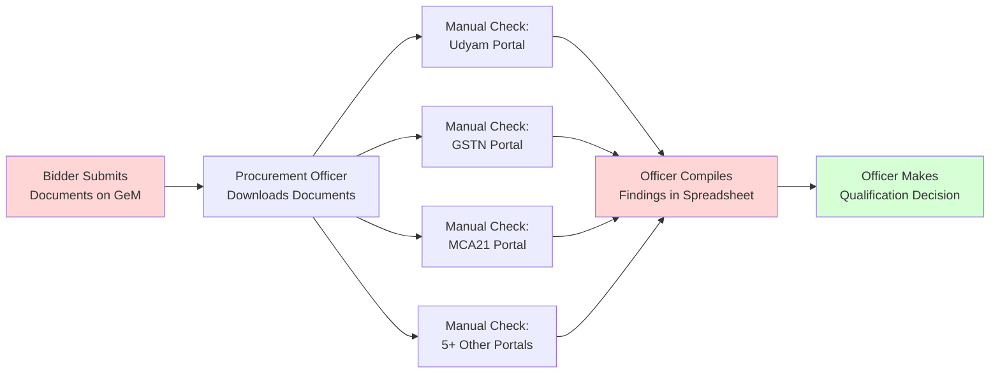
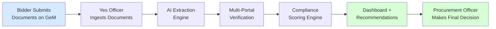
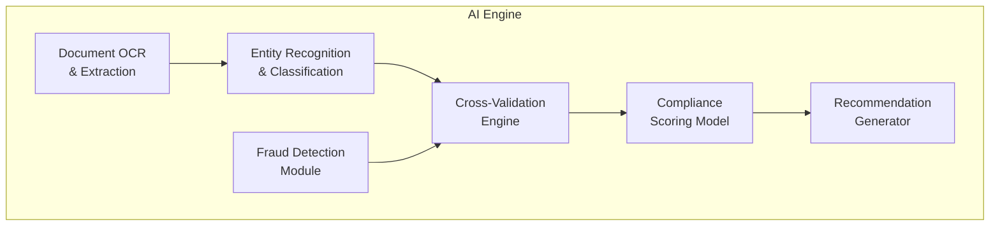
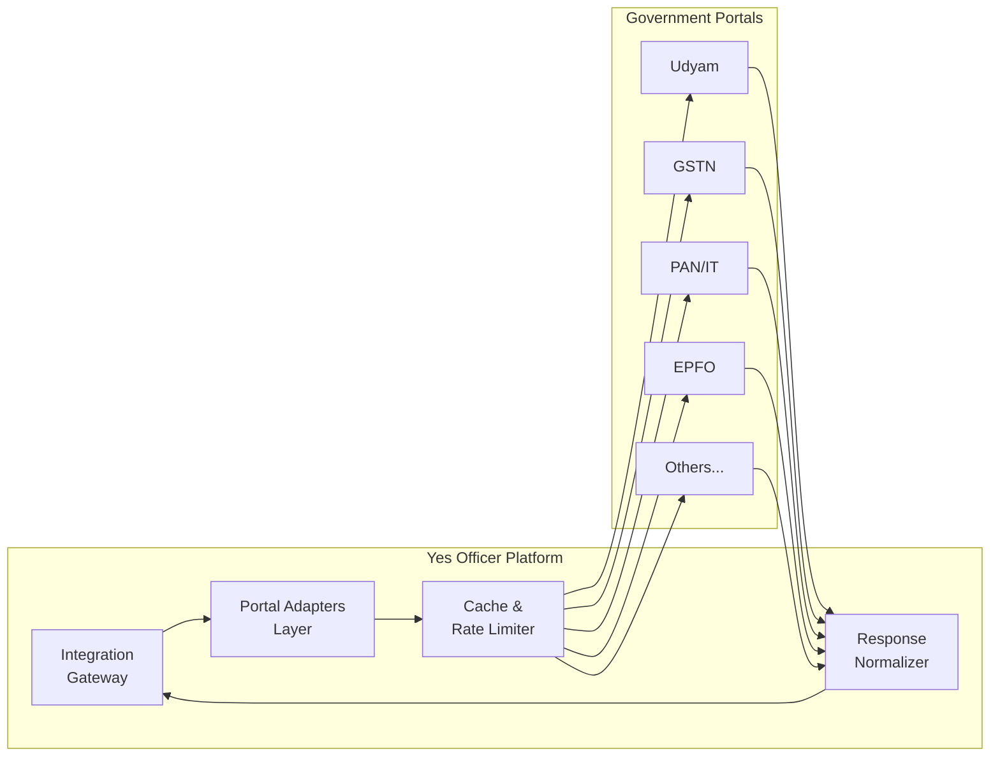
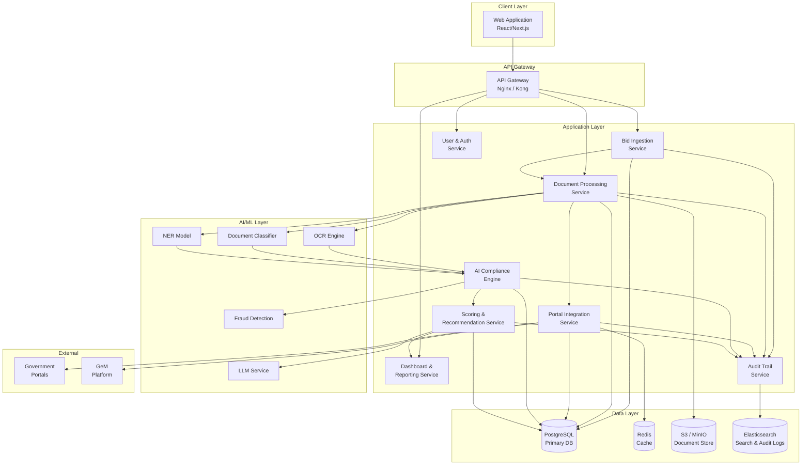
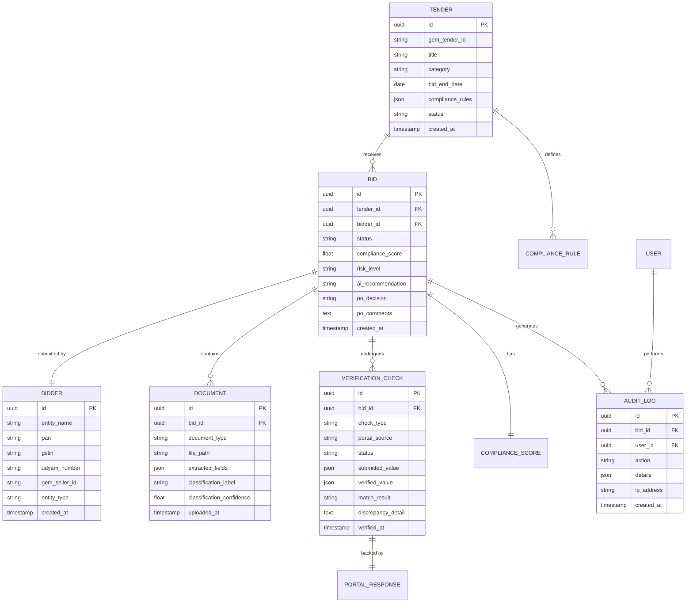
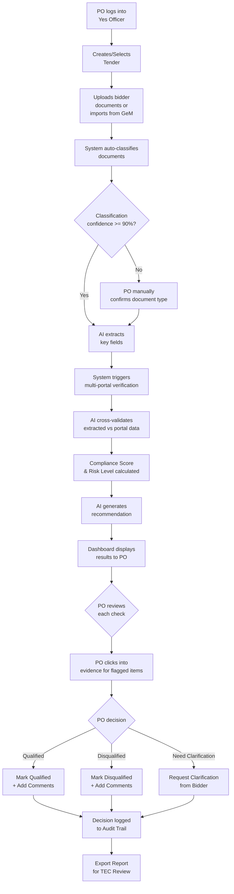
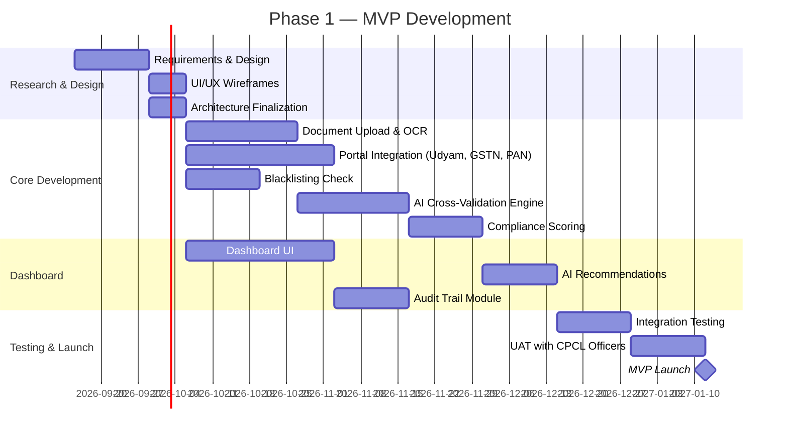

# Product Requirements Document (PRD)

## AI-Powered Integrated Bid Compliance Verification Platform for GeM Procurement

| Field | Detail |
|---|---|
| **Problem Statement ID** | 26100 |
| **Organization** | Ministry of Petroleum & Natural Gas |
| **Department** | Chennai Petroleum Corporation Limited (CPCL) |
| **Category** | Software |
| **Theme** | Smart Automation |
| **Document Version** | 1.0 |
| **Date** | September 6, 2026 |
| **Product Name** | **Yes Officer** — GeM Bid Compliance Verification Platform |

---

## Table of Contents

1. [Executive Summary](#1-executive-summary)
2. [Problem Statement & Context](#2-problem-statement--context)
3. [Goals & Success Metrics](#3-goals--success-metrics)
4. [Target Users & Personas](#4-target-users--personas)
5. [Scope & Boundaries](#5-scope--boundaries)
6. [Functional Requirements](#6-functional-requirements)
7. [AI/ML Requirements](#7-aiml-requirements)
8. [Integration Requirements](#8-integration-requirements)
9. [Non-Functional Requirements](#9-non-functional-requirements)
10. [System Architecture (High-Level)](#10-system-architecture-high-level)
11. [Data Model & Schema Overview](#11-data-model--schema-overview)
12. [User Flows & Wireframe Guidance](#12-user-flows--wireframe-guidance)
13. [Risk Assessment & Mitigation](#13-risk-assessment--mitigation)
14. [Release Plan & Milestones](#14-release-plan--milestones)
15. [Appendices](#15-appendices)

---

## 1. Executive Summary

### 1.1 The Problem

Government procurement through the Government e-Marketplace (GeM) requires Procurement Officers to manually verify **10+ statutory, regulatory, and eligibility requirements** for every bidder across multiple disconnected government portals. This process is:

- **Time-intensive** — Each bid verification can take hours of cross-referencing documents across portals.
- **Error-prone** — Manual checks across disparate systems lead to inconsistencies and missed discrepancies.
- **Non-standardized** — Different officers may apply different verification rigor, leading to compliance gaps.
- **Unauditable** — Paper/manual trails make post-facto audit reconstruction difficult.

### 1.2 The Solution

**Yes Officer** is an AI-powered decision-support platform that automates the verification of bidder compliance for GeM procurement. It integrates with government portals (Udyam, GSTN, MCA21, EPFO, etc.), extracts and cross-validates bidder documents using AI, generates a **Compliance Score** and **Risk Level**, and presents actionable recommendations to Procurement Officers via an intuitive dashboard.

> [!IMPORTANT]
> The platform is a **decision-support tool**. The final qualification/disqualification decision remains exclusively with the Procurement Officer. The AI system does not auto-approve or auto-reject any bidder.

### 1.3 Expected Impact

| Metric | Target |
|---|---|
| Reduction in manual verification effort | 60–80% |
| Tender evaluation cycle time reduction | 40–60% |
| Compliance accuracy improvement | >95% |
| Human error reduction | >70% |
| Full audit trail coverage | 100% |

---

## 2. Problem Statement & Context

### 2.1 Current State ("As-Is")



**Pain Points in Detail:**

| # | Pain Point | Impact |
|---|---|---|
| 1 | Officer manually visits 10+ portals per bidder | 2–4 hours per bidder verification |
| 2 | No automated cross-validation between documents | Fake/mismatched documents slip through |
| 3 | GST return filing status requires date-range checks | Officers often check only registration, not compliance |
| 4 | Blacklisting/debarment data is scattered | Debarred entities can re-enter under different registrations |
| 5 | No standardized compliance scoring | Subjective assessment varies between officers |
| 6 | No persistent audit trail | Difficult to reconstruct decisions during audits/RTIs |

### 2.2 Future State ("To-Be")



### 2.3 Regulatory & Policy Context

- **GeM (Government e-Marketplace)** — Central procurement platform under MoCI, mandatory for government purchases above threshold.
- **GFR (General Financial Rules) 2017** — Rule 149 mandates e-procurement.
- **Public Procurement Order (PPO) 2017** — Mandates Make in India preferences.
- **MSME Development Act, 2006** — Purchase preferences for MSMEs.
- **Startup India Policy** — Relaxations for DPIIT-recognized startups.
- **CPSE procurement guidelines** — Additional CPSE-specific requirements from DPE.

---

## 3. Goals & Success Metrics

### 3.1 Primary Goals

| # | Goal | Measurable Outcome |
|---|---|---|
| G1 | Automate bidder document verification | ≥80% of verification checks automated end-to-end |
| G2 | Reduce tender evaluation time | Evaluation cycle reduced from days to hours |
| G3 | Improve compliance accuracy | <2% false-positive rate on compliance flags |
| G4 | Provide risk-based bidder classification | Every bidder assigned a Compliance Score (0–100) and Risk Level (Low/Medium/High/Critical) |
| G5 | Ensure complete auditability | 100% of verification actions logged with timestamps, sources, and evidence |

### 3.2 Key Performance Indicators (KPIs)

| KPI | Baseline (Manual) | Target (With Platform) |
|---|---|---|
| Avg. time per bidder verification | 2–4 hours | 15–30 minutes |
| Documents verified per officer per day | 5–10 bidders | 40–80 bidders |
| Compliance discrepancy detection rate | ~60% | >95% |
| Audit readiness time | 2–3 days | Real-time |
| Cross-portal inconsistency detection | Sporadic | Systematic, 100% |

### 3.3 Non-Goals (Explicitly Out of Scope)

- The platform **will not** auto-disqualify bidders. All decisions are human-in-the-loop.
- The platform **will not** replace GeM's existing bid submission workflow.
- The platform **will not** handle financial bid evaluation (L1/L2 analysis).
- The platform **will not** generate purchase orders or contracts.

---

## 4. Target Users & Personas

### 4.1 Primary Users

#### Persona 1: Procurement Officer (PO)

| Attribute | Detail |
|---|---|
| **Role** | Evaluates bids and makes qualification decisions |
| **Pain** | Spends 60%+ of evaluation time on compliance verification |
| **Need** | Quick, reliable compliance summary with evidence links |
| **Tech Comfort** | Moderate — comfortable with web portals, not with CLIs |
| **Usage Frequency** | Daily during active tenders |

#### Persona 2: Tender Evaluation Committee (TEC) Member

| Attribute | Detail |
|---|---|
| **Role** | Reviews PO's findings and co-signs evaluation reports |
| **Pain** | Needs to independently verify PO's compliance checks |
| **Need** | Auditable compliance report with source evidence |
| **Usage Frequency** | Weekly/per-tender |

### 4.2 Secondary Users

#### Persona 3: Compliance/Vigilance Officer

| Attribute | Detail |
|---|---|
| **Role** | Audits procurement decisions for compliance violations |
| **Need** | Historical audit trails, flag reports, trend analytics |
| **Usage Frequency** | Monthly/quarterly |

#### Persona 4: System Administrator

| Attribute | Detail |
|---|---|
| **Role** | Manages platform configuration, user access, integrations |
| **Need** | Integration health monitoring, user management, system logs |
| **Usage Frequency** | As needed |

---

## 5. Scope & Boundaries

### 5.1 In-Scope (MVP — Phase 1)

| # | Capability | Priority |
|---|---|---|
| 1 | Document upload & AI extraction (PDF, images) | P0 |
| 2 | Udyam/MSME verification | P0 |
| 3 | GST registration & return filing verification | P0 |
| 4 | PAN verification & Income Tax compliance | P0 |
| 5 | Make in India / Local Content verification | P0 |
| 6 | EPFO/ESIC compliance check | P1 |
| 7 | Startup India (DPIIT) verification | P1 |
| 8 | NSIC registration verification | P1 |
| 9 | OEM Authorization verification | P1 |
| 10 | Blacklisting/debarment check | P0 |
| 11 | AI Compliance Scoring Engine | P0 |
| 12 | Compliance Dashboard | P0 |
| 13 | Audit trail & logging | P0 |
| 14 | AI-generated recommendations | P0 |

### 5.2 In-Scope (Phase 2 — Post-MVP)

| # | Capability | Priority |
|---|---|---|
| 15 | DigiLocker integration for document pull | P2 |
| 16 | MCA21 (Company registration) verification | P2 |
| 17 | BIS certification verification | P2 |
| 18 | Bulk bidder verification (batch processing) | P2 |
| 19 | Tender-specific custom compliance rules engine | P2 |
| 20 | Analytics & trend reporting for Vigilance | P2 |
| 21 | GeM API integration for automatic bid ingestion | P2 |
| 22 | Multi-language support (Hindi + English) | P2 |

### 5.3 Out of Scope

- Financial bid evaluation (L1/L2 commercial scoring)
- Bid submission or modification on GeM
- Payment processing or invoice management
- Vendor performance tracking / post-award monitoring

---

## 6. Functional Requirements

### 6.1 Module 1: Bid Ingestion & Document Management

| FR ID | Requirement | Priority | Acceptance Criteria |
|---|---|---|---|
| FR-1.1 | System shall allow PO to upload bidder documents (PDF, JPEG, PNG, TIFF) | P0 | Supports files up to 25 MB, drag-and-drop + file picker |
| FR-1.2 | System shall accept bulk upload of multiple bidder documents in a single tender | P0 | Upload 50+ documents in a batch, progress indicator shown |
| FR-1.3 | System shall automatically classify uploaded documents by type (GST cert, PAN card, Udyam cert, etc.) | P0 | ≥90% auto-classification accuracy |
| FR-1.4 | System shall extract key fields from documents using OCR + AI | P0 | Extracts: registration numbers, dates, names, amounts with ≥95% accuracy on clear documents |
| FR-1.5 | System shall maintain document version history per bidder per tender | P1 | Bidder resubmissions tracked with timestamps |
| FR-1.6 | System shall support GeM bid data import via CSV/JSON | P1 | Standard GeM export format supported |

### 6.2 Module 2: Multi-Portal Verification Engine

| FR ID | Requirement | Portal/Source | Priority |
|---|---|---|---|
| FR-2.1 | Verify Udyam Registration Number and MSME category (Micro/Small/Medium) | Udyam Portal | P0 |
| FR-2.2 | Verify GST registration status (Active/Cancelled/Suspended) | GSTN | P0 |
| FR-2.3 | Verify GST return filing status for last 6 months (GSTR-1, GSTR-3B) | GSTN | P0 |
| FR-2.4 | Verify PAN validity and link to entity name | Income Tax / PAN Verification | P0 |
| FR-2.5 | Check Income Tax return filing status for last 3 assessment years | Income Tax Portal | P1 |
| FR-2.6 | Verify EPFO establishment registration and compliance | EPFO | P1 |
| FR-2.7 | Verify ESIC registration and contribution status | ESIC | P1 |
| FR-2.8 | Verify DPIIT Startup India recognition and validity | Startup India Portal | P1 |
| FR-2.9 | Verify NSIC registration and certificate validity | NSIC | P1 |
| FR-2.10 | Check entity against blacklisting/debarment databases | GeM, CVC, CPSEs | P0 |
| FR-2.11 | Verify OEM authorization letter authenticity | AI Document Verification | P1 |
| FR-2.12 | Verify Make in India / local content self-certification | DPIIT / PPO Guidelines | P0 |
| FR-2.13 | Verify MCA21 company incorporation and director details | MCA21 | P2 |
| FR-2.14 | Pull verified documents from DigiLocker | DigiLocker API | P2 |
| FR-2.15 | Verify BIS certification for applicable product categories | BIS Portal | P2 |

> [!NOTE]
> Where direct API integration is not available (some government portals lack public APIs), the system shall use **supervised web scraping** or **manual verification prompts** as fallback, clearly marking the data source and verification method.

### 6.3 Module 3: AI Compliance Engine

| FR ID | Requirement | Priority |
|---|---|---|
| FR-3.1 | Cross-validate entity name, PAN, GSTIN, and Udyam number for consistency | P0 |
| FR-3.2 | Detect mismatches between document-stated values and portal-verified values | P0 |
| FR-3.3 | Identify missing mandatory documents based on tender type | P0 |
| FR-3.4 | Flag expired certificates/registrations | P0 |
| FR-3.5 | Validate Make in India local content percentage against PPO thresholds | P0 |
| FR-3.6 | Detect potentially fraudulent documents (image manipulation, inconsistent fonts, metadata anomalies) | P1 |
| FR-3.7 | Apply tender-specific eligibility rules (turnover threshold, experience years, etc.) | P1 |
| FR-3.8 | Generate a Compliance Score (0–100) based on weighted verification results | P0 |
| FR-3.9 | Classify bidder risk level: Low (80–100), Medium (60–79), High (40–59), Critical (<40) | P0 |
| FR-3.10 | Generate natural-language AI recommendation summary per bidder | P0 |

### 6.4 Module 4: Compliance Dashboard

| FR ID | Requirement | Priority |
|---|---|---|
| FR-4.1 | Display tender-level overview showing all bidders with compliance scores | P0 |
| FR-4.2 | Display bidder-level detail view with per-check verification status | P0 |
| FR-4.3 | Color-coded status indicators: ✅ Verified, ⚠️ Warning, ❌ Failed, ⏳ Pending | P0 |
| FR-4.4 | Side-by-side comparison of submitted documents vs. portal-verified data | P0 |
| FR-4.5 | Filterable/sortable bidder list by compliance score, risk level, or specific checks | P1 |
| FR-4.6 | One-click drill-down to evidence (source document + portal screenshot/data) | P0 |
| FR-4.7 | PO action panel: Accept / Reject / Request Clarification with mandatory comments | P0 |
| FR-4.8 | Export compliance report as PDF for committee review | P0 |
| FR-4.9 | Real-time notification when verification results are ready | P1 |
| FR-4.10 | Analytics view: compliance trends, common failure reasons, processing times | P2 |

### 6.5 Module 5: Audit Trail & Reporting

| FR ID | Requirement | Priority |
|---|---|---|
| FR-5.1 | Log every verification action with timestamp, user, source, and result | P0 |
| FR-5.2 | Log every PO decision with comments and justification | P0 |
| FR-5.3 | Maintain immutable audit trail (append-only, no deletion) | P0 |
| FR-5.4 | Generate audit-ready compliance reports per tender | P0 |
| FR-5.5 | Support audit query: "Show all verification activities for Tender X, Bidder Y" | P0 |
| FR-5.6 | Retain all audit data for minimum 7 years per government record retention policy | P1 |
| FR-5.7 | Export audit logs in machine-readable format (CSV/JSON) | P1 |

### 6.6 Module 6: User & Access Management

| FR ID | Requirement | Priority |
|---|---|---|
| FR-6.1 | Role-based access control (RBAC): Admin, Procurement Officer, TEC Member, Auditor | P0 |
| FR-6.2 | SSO integration with GeM/government identity systems | P2 |
| FR-6.3 | Multi-factor authentication (MFA) for all users | P0 |
| FR-6.4 | Activity logging per user session | P0 |
| FR-6.5 | Password policy enforcement (complexity, rotation, lockout) | P0 |

---

## 7. AI/ML Requirements

### 7.1 AI Subsystems



### 7.2 AI Component Specifications

| Component | Technology | Input | Output |
|---|---|---|---|
| **OCR Engine** | Tesseract / Azure Document Intelligence / Google Document AI | Scanned PDFs, images | Extracted text + field positions |
| **Document Classifier** | Fine-tuned transformer model (BERT/LayoutLM) | Extracted text + layout | Document type label + confidence |
| **Named Entity Extraction** | Custom NER model | Document text | Structured fields: PAN, GSTIN, Registration No., dates, amounts |
| **Cross-Validation Engine** | Rule-based + ML anomaly detection | Extracted fields + portal data | Match/mismatch flags with severity |
| **Fraud Detection** | Image forensics + metadata analysis | Document images | Tampering probability score |
| **Compliance Scoring** | Weighted rule engine + supervised ML | All verification results | Score (0–100) + risk level |
| **Recommendation Generator** | LLM (GPT-4 / Gemini / fine-tuned Llama) | Compliance results + tender rules | Natural language recommendation |

### 7.3 Model Performance Requirements

| Model | Metric | Target |
|---|---|---|
| OCR Extraction | Field-level accuracy | ≥95% on print, ≥85% on handwritten |
| Document Classification | Accuracy | ≥92% |
| NER (Key Field Extraction) | F1 Score | ≥90% |
| Fraud Detection | Precision | ≥85% (minimize false positives) |
| Cross-Validation | Mismatch detection recall | ≥95% |

### 7.4 Training Data Requirements

| Dataset | Source | Estimated Volume |
|---|---|---|
| Government certificates (Udyam, GST, PAN) | Anonymized samples from CPCL procurement archives | 5,000–10,000 documents |
| Known fraudulent documents | Historical cases + synthetic augmentation | 500–1,000 samples |
| Compliance decisions (labeled) | Past tender evaluation records | 2,000–5,000 bidder records |
| Portal response formats | API/scrape samples from each portal | 100+ per portal |

> [!WARNING]
> All training data must be **anonymized** and handled per the **IT Act, 2000** and **Digital Personal Data Protection Act, 2023**. PII must be masked/tokenized before model training.

---

## 8. Integration Requirements

### 8.1 Government Portal Integrations

| # | Portal/System | Integration Method | Data Retrieved | Availability |
|---|---|---|---|---|
| 1 | **Udyam Registration** | API (udyamregistration.gov.in) | Registration status, MSME category, NIC code | Public API available |
| 2 | **GSTN** | GSP API / GSTN Open API | Registration status, filing status (GSTR-1, GSTR-3B) | Via GST Suvidha Provider |
| 3 | **PAN Verification** | NSDL / UTIITSL API | PAN validity, name match | Paid API |
| 4 | **Income Tax** | IT Department API / Compliance Check | Filing status for AYs | Limited API |
| 5 | **EPFO** | EPFO API / Unified Portal | Establishment code validity, compliance status | Limited API |
| 6 | **ESIC** | ESIC Portal API | Registration and contribution status | Limited API |
| 7 | **Startup India (DPIIT)** | Startup India API | Recognition certificate validity | Public API available |
| 8 | **NSIC** | NSIC Portal | Registration validity | Scrape fallback |
| 9 | **MCA21** | MCA21 API / V3 Portal | Company details, director info, active status | Paid API |
| 10 | **GeM** | GeM Open API | Bidder registration, bid details, blacklist | API available |
| 11 | **DigiLocker** | DigiLocker API | Verified documents (Aadhaar, PAN, certificates) | Public API |
| 12 | **CVC/Blacklist DBs** | CVC website / GeM debarment list | Debarment status | Scrape + DB |
| 13 | **BIS** | BIS Portal | Product certification status | Limited API |

### 8.2 Integration Architecture Pattern



### 8.3 Integration Resilience Requirements

| Requirement | Detail |
|---|---|
| **Timeout handling** | Max 30s per portal call, graceful degradation on timeout |
| **Retry logic** | 3 retries with exponential backoff |
| **Fallback strategy** | Mark check as "Pending Manual Verification" if portal unavailable |
| **Caching** | Cache portal responses for 24 hours (configurable) to reduce redundant calls |
| **Rate limiting** | Respect per-portal rate limits; queue excess requests |
| **Circuit breaker** | Disable portal integration after 5 consecutive failures; auto-recover with health checks |

---

## 9. Non-Functional Requirements

### 9.1 Performance

| Metric | Requirement |
|---|---|
| Single bidder verification (all checks) | ≤ 3 minutes end-to-end |
| Dashboard page load | ≤ 2 seconds |
| Concurrent users supported | ≥ 100 |
| Document upload processing | ≤ 30 seconds per document |
| Bulk verification (50 bidders) | ≤ 30 minutes |

### 9.2 Security

| Requirement | Standard/Detail |
|---|---|
| Data encryption at rest | AES-256 |
| Data encryption in transit | TLS 1.3 |
| Authentication | MFA mandatory; session timeout 30 min |
| Authorization | RBAC with least-privilege principle |
| Data classification | Follows government data classification guidelines |
| Compliance | IT Act 2000, DPDP Act 2023, MeitY security guidelines |
| Vulnerability management | OWASP Top 10 compliance; quarterly VAPT |
| PII handling | Anonymization in logs; encrypted storage; access-controlled views |

### 9.3 Availability & Reliability

| Metric | Requirement |
|---|---|
| Uptime SLA | 99.5% (excluding planned maintenance) |
| RPO (Recovery Point Objective) | ≤ 1 hour |
| RTO (Recovery Time Objective) | ≤ 4 hours |
| Backup frequency | Daily full + hourly incremental |
| Disaster recovery | Active-passive across availability zones |

### 9.4 Scalability

| Dimension | Requirement |
|---|---|
| Bidders per tender | Support up to 500 bidders |
| Concurrent tenders | Support up to 50 active tenders |
| Annual document volume | Up to 500,000 documents |
| Horizontal scaling | Stateless services behind load balancer |

### 9.5 Accessibility & Usability

| Requirement | Detail |
|---|---|
| Browser support | Chrome 90+, Edge 90+, Firefox 90+ |
| Responsive design | Desktop-first; tablet-friendly |
| Accessibility | WCAG 2.1 Level AA compliance |
| Language | English (default); Hindi (Phase 2) |
| Onboarding | In-app guided tour for first-time users |

---

## 10. System Architecture (High-Level)



### 10.1 Technology Stack (Recommended)

| Layer | Technology | Rationale |
|---|---|---|
| **Frontend** | Next.js 14+ (React) with TypeScript | SSR for dashboard performance; strong ecosystem |
| **UI Library** | shadcn/ui + Tailwind CSS | Modern, accessible components |
| **Backend API** | Node.js (NestJS) or Python (FastAPI) | NestJS for structured backend; FastAPI for AI-heavy workloads |
| **AI/ML Runtime** | Python (PyTorch / ONNX) | Industry standard for ML model serving |
| **OCR** | Google Document AI or Tesseract + LayoutLM | Best accuracy for Indian government documents |
| **LLM** | Gemini API / GPT-4 API / Self-hosted Llama 3 | Recommendation generation; Gemini preferred for govt context |
| **Database** | PostgreSQL 15+ | ACID compliance, JSON support, mature ecosystem |
| **Cache** | Redis | Portal response caching, session management |
| **Document Storage** | MinIO (self-hosted S3-compatible) | Government data sovereignty requirements |
| **Search / Audit** | Elasticsearch | Full-text search across audit logs |
| **Message Queue** | RabbitMQ / Redis Streams | Async document processing and portal verification |
| **Containerization** | Docker + Kubernetes | Orchestration, scaling, government cloud deployment |
| **CI/CD** | GitHub Actions | Automated testing and deployment |
| **Monitoring** | Prometheus + Grafana | System health and performance monitoring |

---

## 11. Data Model & Schema Overview

### 11.1 Core Entities



### 11.2 Key Enumerations

| Enum | Values |
|---|---|
| **Check Status** | `PENDING`, `VERIFIED`, `MISMATCH`, `FAILED`, `NOT_APPLICABLE`, `MANUAL_REVIEW` |
| **Risk Level** | `LOW`, `MEDIUM`, `HIGH`, `CRITICAL` |
| **PO Decision** | `QUALIFIED`, `DISQUALIFIED`, `CLARIFICATION_REQUESTED`, `PENDING` |
| **Document Type** | `UDYAM_CERT`, `GST_CERT`, `PAN_CARD`, `ITR`, `EPFO_CERT`, `ESIC_CERT`, `STARTUP_CERT`, `NSIC_CERT`, `OEM_AUTH`, `MII_CERT`, `BIS_CERT`, `OTHER` |

---

## 12. User Flows & Wireframe Guidance

### 12.1 Primary User Flow: Bid Compliance Verification



### 12.2 Dashboard Layout Guidance

#### 12.2.1 Tender Overview Screen

```
┌─────────────────────────────────────────────────────────────┐
│  🏛️  Yes Officer — Tender Dashboard                        │
├─────────────────────────────────────────────────────────────┤
│                                                             │
│  Tender: GEM/2026/B/XXXX — Supply of Industrial Equipment  │
│  Status: Under Evaluation    Due: Sept 15, 2026             │
│                                                             │
│  ┌──────────────────────────────────────────────────────┐   │
│  │ Summary Cards                                        │   │
│  │ [Total: 24] [Verified: 18] [Issues: 4] [Pending: 2] │   │
│  └──────────────────────────────────────────────────────┘   │
│                                                             │
│  ┌──────────────────────────────────────────────────────┐   │
│  │ Bidder List (Sortable by Score / Risk)               │   │
│  │                                                       │   │
│  │ # │ Bidder Name    │ Score │ Risk   │ Status  │ Action│  │
│  │ 1 │ ABC Industries │  92   │ Low    │ ✅ Done │ View  │  │
│  │ 2 │ XYZ Pvt Ltd    │  74   │ Medium │ ⚠️ Issues│ View │  │
│  │ 3 │ PQR Traders    │  38   │ Critical│ ❌ Flags│ View │  │
│  │ 4 │ DEF Corp       │  --   │ --     │ ⏳ Pending│ View│  │
│  └──────────────────────────────────────────────────────┘   │
└─────────────────────────────────────────────────────────────┘
```

#### 12.2.2 Bidder Detail Screen

```
┌─────────────────────────────────────────────────────────────┐
│  Bidder: XYZ Pvt Ltd    Score: 74/100    Risk: MEDIUM       │
├─────────────────────────────────────────────────────────────┤
│                                                             │
│  AI Recommendation:                                         │
│  ┌──────────────────────────────────────────────────────┐   │
│  │ "XYZ Pvt Ltd has valid Udyam and GST registrations,  │   │
│  │  but GSTR-3B filing is delayed for 2 months.          │   │
│  │  EPFO compliance check returned inconsistent employee │   │
│  │  count. Recommend manual review of EPFO documents     │   │
│  │  before qualification decision."                      │   │
│  └──────────────────────────────────────────────────────┘   │
│                                                             │
│  Verification Checks:                                       │
│  ┌──────────────────────────────────────────────────────┐   │
│  │ ✅ PAN Verified (AXXPX1234X matches portal)          │   │
│  │ ✅ Udyam Verified (UDYAM-TN-00-0XXXXXX — Small)     │   │
│  │ ✅ GST Registered (Active)                           │   │
│  │ ⚠️ GST Returns (GSTR-3B not filed for Jul, Aug 2026)│   │
│  │ ✅ Not Blacklisted                                   │   │
│  │ ❌ EPFO (Employee count mismatch: Doc=50, Portal=32) │   │
│  │ ✅ Make in India (Self-cert 65%, threshold 50%)      │   │
│  │ ⏳ ESIC (Portal timeout — pending retry)             │   │
│  └──────────────────────────────────────────────────────┘   │
│                                                             │
│  [Accept ✅]  [Reject ❌]  [Request Clarification 📧]       │
│                                                             │
│  Comments: [_________________________________]              │
└─────────────────────────────────────────────────────────────┘
```

---

## 13. Risk Assessment & Mitigation

### 13.1 Technical Risks

| # | Risk | Likelihood | Impact | Mitigation |
|---|---|---|---|---|
| R1 | Government portal APIs unavailable or undocumented | High | High | Build adapter layer with scrape fallback; design for graceful degradation; mark as "Manual Review Required" |
| R2 | OCR accuracy low on poor-quality scans | Medium | Medium | Pre-processing pipeline (de-skew, enhance); confidence thresholds; flag for human review below threshold |
| R3 | Portal rate limiting blocks batch verification | Medium | Medium | Queue-based processing; respect rate limits; cache responses; off-peak scheduling |
| R4 | AI model hallucinations in recommendations | Medium | High | Ground recommendations strictly in verification data; human review mandatory; no auto-decisions |
| R5 | Data breach / PII exposure | Low | Critical | Encryption at rest & transit; RBAC; audit logging; regular VAPT; DPDP Act compliance |

### 13.2 Operational Risks

| # | Risk | Likelihood | Impact | Mitigation |
|---|---|---|---|---|
| R6 | User adoption resistance | Medium | High | Intuitive UI; training program; gradual rollout; champion user program |
| R7 | Regulatory changes to compliance requirements | Medium | Medium | Configurable rules engine; tender-specific rule templates; quarterly rule updates |
| R8 | Government portal format/API changes | High | Medium | Abstracted adapter layer; monitoring for breaking changes; versioned adapters |
| R9 | Scope creep into financial bid evaluation | Medium | Medium | Clear product boundaries documented; stakeholder alignment |

### 13.3 Legal/Compliance Risks

| # | Risk | Likelihood | Impact | Mitigation |
|---|---|---|---|---|
| R10 | Legal challenge on AI-assisted decisions | Low | High | AI is advisory only; PO makes all decisions; full audit trail; explainable AI outputs |
| R11 | Data sovereignty concerns | Low | Medium | Host on government cloud (NIC/MeitY cloud); no data leaves Indian jurisdiction |

---

## 14. Release Plan & Milestones

### 14.1 Phase 1 — MVP (Weeks 1–12)



### 14.2 Phase 2 — Enhancement (Weeks 13–20)

| Milestone | Deliverable | Timeline |
|---|---|---|
| M5 | EPFO, ESIC, Startup India, NSIC integrations | Weeks 13–16 |
| M6 | DigiLocker integration | Weeks 15–17 |
| M7 | Custom compliance rules engine | Weeks 16–18 |
| M8 | Analytics & trend reporting | Weeks 18–20 |
| M9 | Phase 2 release | Week 20 |

### 14.3 Phase 3 — Scale (Weeks 21–28)

| Milestone | Deliverable | Timeline |
|---|---|---|
| M10 | GeM API direct integration for bid ingestion | Weeks 21–24 |
| M11 | Multi-CPSE rollout (beyond CPCL) | Weeks 23–26 |
| M12 | Hindi language support | Weeks 25–27 |
| M13 | Production hardening & scale testing | Weeks 27–28 |

---

## 15. Appendices

### Appendix A: Compliance Check Weightage Matrix (Default)

| Check | Weight | Mandatory | Notes |
|---|---|---|---|
| PAN Verification | 10% | Yes | Foundational identity check |
| GST Registration | 10% | Yes | Active status required |
| GST Return Filing | 15% | Yes | Last 6 months GSTR-3B |
| Udyam/MSME | 10% | Conditional | Required if claiming MSME benefits |
| Blacklisting/Debarment | 15% | Yes | Instant disqualifier if blacklisted |
| Make in India / Local Content | 10% | Conditional | Per PPO requirements |
| Income Tax Compliance | 10% | Yes | ITR filed for last 3 AYs |
| EPFO Compliance | 5% | Conditional | If ≥20 employees |
| ESIC Compliance | 5% | Conditional | If applicable under Act |
| OEM Authorization | 5% | Conditional | For authorized resellers |
| Startup India / NSIC | 5% | Conditional | If claiming relaxations |

> [!TIP]
> Weights are configurable per tender. The PO or Admin can adjust weights through the compliance rules configuration for each tender based on specific requirements.

### Appendix B: Glossary

| Term | Definition |
|---|---|
| **GeM** | Government e-Marketplace — India's online procurement platform |
| **GSTN** | Goods and Services Tax Network |
| **Udyam** | MSME registration system |
| **MCA21** | Ministry of Corporate Affairs portal for company registration |
| **EPFO** | Employees' Provident Fund Organisation |
| **ESIC** | Employees' State Insurance Corporation |
| **DPIIT** | Department for Promotion of Industry and Internal Trade |
| **NSIC** | National Small Industries Corporation |
| **PPO** | Public Procurement Order |
| **BIS** | Bureau of Indian Standards |
| **CPSE** | Central Public Sector Enterprise |
| **PO** | Procurement Officer |
| **TEC** | Tender Evaluation Committee |
| **VAPT** | Vulnerability Assessment and Penetration Testing |
| **DPDP Act** | Digital Personal Data Protection Act, 2023 |

### Appendix C: Compliance Score Calculation Formula

```
Compliance Score = Σ (Check_Weight × Check_Score) / Σ (Applicable_Check_Weights)

Where:
  Check_Score = 1.0 (Verified) | 0.5 (Warning/Partial) | 0.0 (Failed/Missing)
  
  Only applicable checks are included in the denominator.
  
  Special Rules:
  - Blacklisted bidder → Score automatically set to 0, Risk = CRITICAL
  - >2 failed mandatory checks → Risk escalated to HIGH minimum

Risk Classification:
  80–100 → LOW
  60–79  → MEDIUM
  40–59  → HIGH
  0–39   → CRITICAL
```

### Appendix D: API Response Format (Standard)

```json
{
  "status": "success | error",
  "data": {
    "bidder_id": "uuid",
    "compliance_score": 74,
    "risk_level": "MEDIUM",
    "checks": [
      {
        "check_type": "GST_REGISTRATION",
        "status": "VERIFIED",
        "submitted_value": "33AABCU9603R1ZM",
        "verified_value": "33AABCU9603R1ZM",
        "match": true,
        "source": "GSTN API",
        "verified_at": "2026-09-06T12:00:00Z"
      }
    ],
    "recommendation": "string",
    "verified_at": "2026-09-06T12:05:00Z"
  },
  "audit_id": "uuid"
}
```

### Appendix E: References

1. GeM Portal — [https://gem.gov.in](https://gem.gov.in)
2. Udyam Registration — [https://udyamregistration.gov.in](https://udyamregistration.gov.in)
3. GSTN — [https://www.gst.gov.in](https://www.gst.gov.in)
4. Startup India — [https://www.startupindia.gov.in](https://www.startupindia.gov.in)
5. Public Procurement Order 2017 — DPIIT
6. General Financial Rules 2017 — Ministry of Finance
7. Digital Personal Data Protection Act, 2023
8. MeitY Cloud Security Guidelines

---

> **Document Status:** Draft v1.0 — Pending stakeholder review  
> **Next Steps:** Stakeholder review → Finalize scope → Begin Phase 1 development
