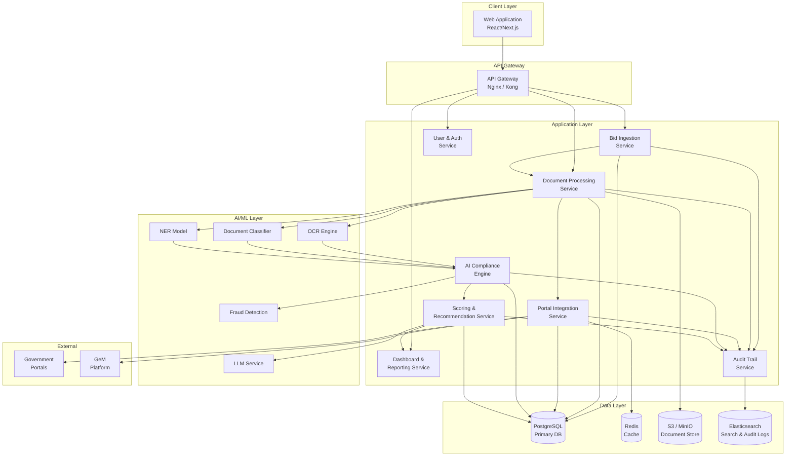
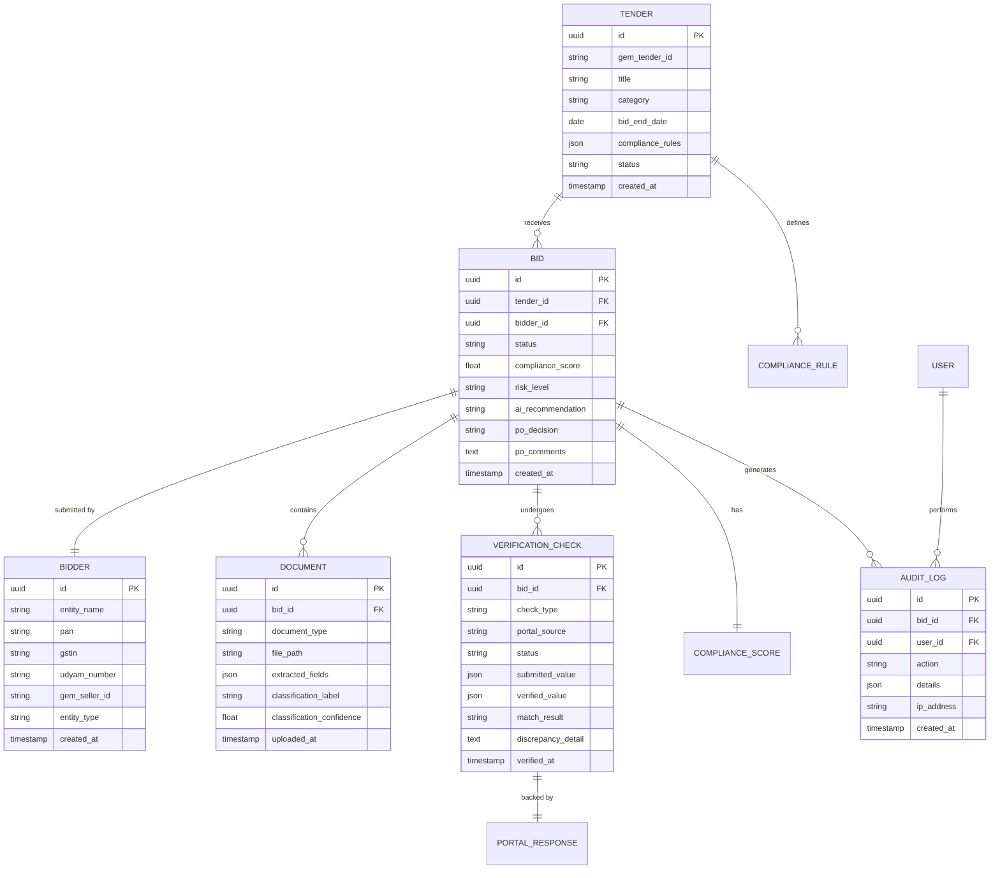
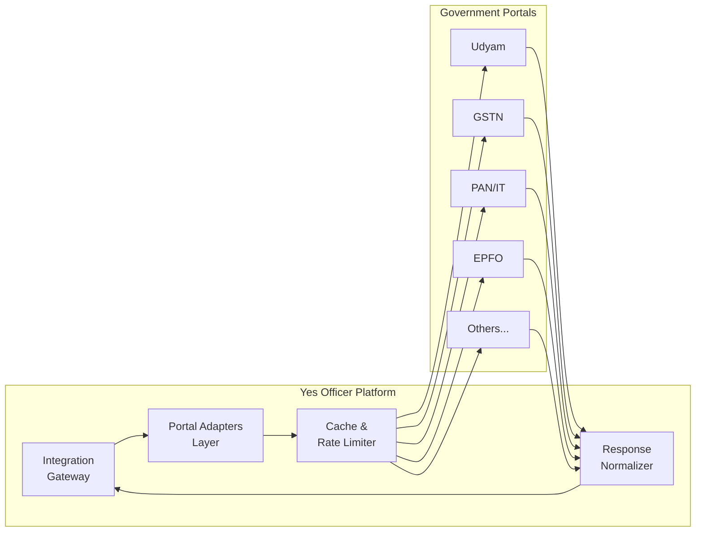
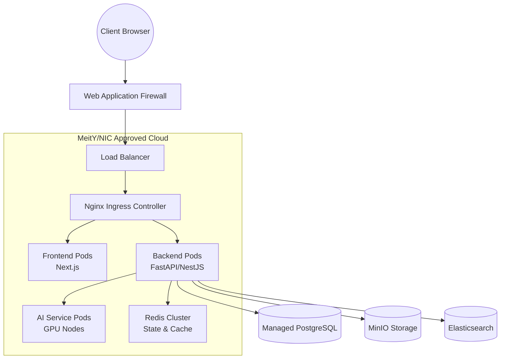

# Technical Design Document (TDD) / Architecture Document

## Yes Officer — AI-Powered Integrated Bid Compliance Verification Platform

| Field | Detail |
|---|---|
| **Project Name** | Yes Officer |
| **Document Type** | Technical Design Document (TDD) |
| **Version** | 1.0 |
| **Date** | September 6, 2026 |

---

## Table of Contents
1. [Executive Summary](#1-executive-summary)
2. [System Architecture Overview](#2-system-architecture-overview)
3. [Technology Stack](#3-technology-stack)
4. [Component Design](#4-component-design)
5. [Data Model & Schema](#5-data-model--schema)
6. [Integration Architecture](#6-integration-architecture)
7. [AI Subsystem Design](#7-ai-subsystem-design)
8. [Security & Compliance Architecture](#8-security--compliance-architecture)
9. [Deployment Architecture](#9-deployment-architecture)

---

## 1. Executive Summary

This Technical Design Document (TDD) defines the architecture and technical specifications for the **Yes Officer** platform. Yes Officer is an AI-powered decision-support tool that automates the verification of bidder compliance for GeM procurement by integrating with various government portals, validating documents, and generating compliance scores. 

This document serves as the technical blueprint for the engineering team, complementing the Product Requirements Document (PRD) and Business Requirements Document (BRD).

---

## 2. System Architecture Overview

The system follows a modern microservices-oriented architecture using a clear separation of concerns among the Client Layer, API Gateway, Application Layer, Data Layer, AI/ML Layer, and External Integrations.

---

## 3. Technology Stack

| Layer | Technology | Rationale |
|---|---|---|
| **Frontend** | Next.js 14+ (React), TypeScript | SSR for dashboard performance; strong ecosystem |
| **UI Library** | shadcn/ui + Tailwind CSS | Modern, accessible components |
| **Backend API** | Node.js (NestJS) or Python (FastAPI) | Fast API development, robust typing, great AI integration (FastAPI) |
| **AI/ML Runtime** | Python (PyTorch / ONNX) | Industry standard for ML model serving |
| **OCR** | Tesseract + LayoutLM / Google Doc AI | Best accuracy for Indian government documents |
| **LLM** | Gemini API / Llama 3 (Self-hosted) | Recommendation generation |
| **Primary Database** | PostgreSQL 15+ | ACID compliance, JSON support, mature ecosystem |
| **Cache & Queue** | Redis | Portal response caching, asynchronous task queues |
| **Document Storage** | MinIO (S3-compatible) | Government data sovereignty requirements |
| **Search / Audit** | Elasticsearch | Full-text search across audit logs |
| **Containerization** | Docker + Kubernetes | Orchestration, scaling, government cloud deployment |
| **CI/CD** | GitHub Actions | Automated testing and deployment |

---

## 4. Component Design

### 4.1 Client Layer (Frontend)
- **Framework:** Next.js utilizing the App Router.
- **State Management:** React Context / Zustand for local state; React Query for server state management and caching.
- **Security:** CSRF protection, strict Content Security Policies (CSP), and HTTP-only cookies for JWT tokens.

### 4.2 Application Services
- **Bid Ingestion Service:** Handles bulk and single uploads of bidder documents, and parsing GeM CSV/JSON data.
- **Document Processing Service:** Orchestrates the AI pipeline for classification, OCR, and NER. Interacts heavily with MinIO and the AI Layer.
- **Portal Integration Service:** The adapter layer interfacing with external government APIs. Includes circuit breakers, exponential backoff, and caching.
- **AI Compliance Engine:** Executes the cross-validation logic between extracted document fields and portal API responses.
- **Scoring & Recommendation Service:** Applies tender-specific weighted rules to calculate the Compliance Score (0-100) and interacts with the LLM to generate plain-language advisory recommendations.
- **Audit Trail Service:** An append-only service that writes every action, decision, and system event to Elasticsearch.

---

## 5. Data Model & Schema

The primary relational data model is hosted in PostgreSQL.

---

## 6. Integration Architecture

The **Portal Integration Service** uses an adapter pattern to connect to various external systems. 

### Resilience Mechanisms
- **Rate Limiting:** Adheres to external API quotas (e.g., max 100 requests/minute for GSTN).
- **Caching:** Redis caches successful portal responses for up to 24 hours to minimize redundant calls and save costs.
- **Circuit Breaker:** Stops querying an endpoint after 5 consecutive failures, flagging the verification as `MANUAL_REVIEW`.
- **Fallback:** Where APIs don't exist (e.g., NSIC), supervised web scraping is used as a fallback, explicitly marked in the audit trail.

---

## 7. AI Subsystem Design

The AI Pipeline operates sequentially upon document upload:

1. **Document Classification:** Fine-tuned LayoutLM classifies the document (e.g., `UDYAM_CERT`, `GST_CERT`). If confidence < 90%, it requests human verification.
2. **OCR & NER Extraction:** Custom Named Entity Recognition models extract target fields (PAN, GSTIN, Dates) from the OCR output.
3. **Cross-Validation:** A deterministic rule engine compares extracted values against Portal Integration Service responses.
4. **Fraud Detection:** Image forensics look for EXIF anomalies and localized compression artifacts (copy-paste forgery).
5. **LLM Recommendation:** The LLM generates a natural language summary combining all findings into an actionable recommendation for the Procurement Officer.

---

## 8. Security & Compliance Architecture

- **Data Privacy (DPDP Act 2023):** Data minimisation is enforced. PII is masked in application logs.
- **Encryption:** 
  - *At Rest:* AES-256 for PostgreSQL and MinIO.
  - *In Transit:* TLS 1.3 across all internal and external communication.
- **Authentication & Authorization:**
  - MFA is mandatory.
  - Strict Role-Based Access Control (RBAC): Admin, Procurement Officer, TEC Member, Auditor.
- **Immutability:** The Audit Trail Service uses an append-only architecture into Elasticsearch. No UPDATE or DELETE operations are permitted on audit indices.

---

## 9. Deployment Architecture

The application is deployed on a MeitY-approved government cloud environment (e.g., NIC Cloud) using Kubernetes.

### Key Considerations:
- **Scaling:** Frontend and Backend pods scale horizontally based on CPU/Memory usage. AI Service pods can be scaled independently, potentially utilizing GPU nodes for faster inference.
- **Disaster Recovery:** Active-passive multi-AZ deployment with daily full and hourly incremental database backups. RTO ≤ 4 hours, RPO ≤ 1 hour.
